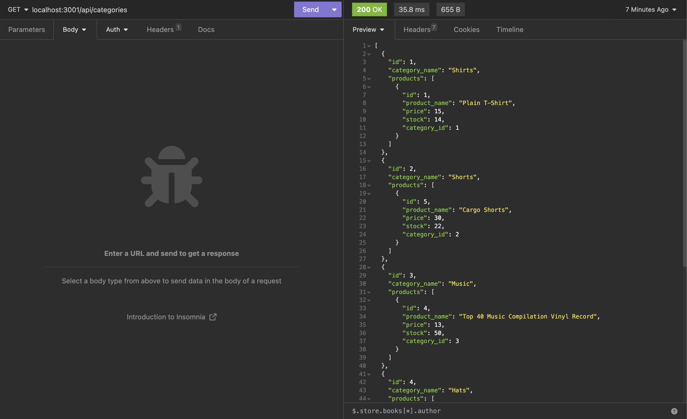

## E-Commerce Back End App

# Description

This is the backend portion of an e-commerce site that allows users to use CRUD operations to interact with their product database.

# Installation
Use Insomnia, MySQL2, Sequelize and .env to use the application.

# Usage
Backend of an E-Commerce platform to manage products.

# License
MIT License

# Contributors

Created By Matt S. for Vanderbilt Full Stack Coding Program

# Example Video

https://watch.screencastify.com/v/Zk06u1OjiTngL5BQ7DIk
